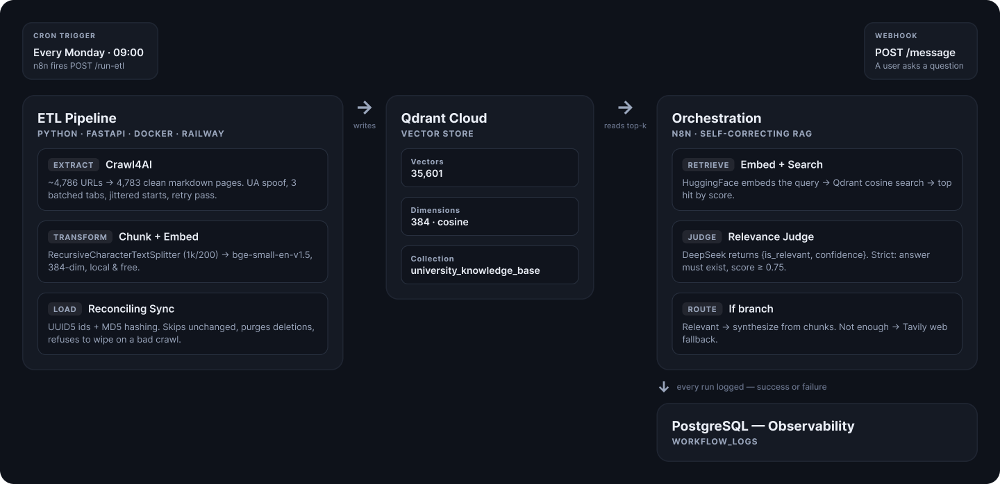
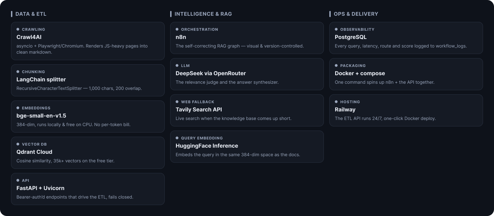
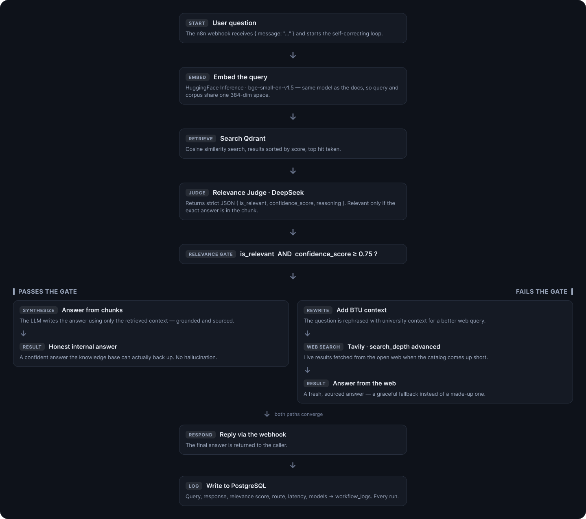

# Self-Correcting RAG with Web Fallback

**Most RAG systems confidently hallucinate when they don't know the answer. This one admits it doesn't, then goes to the web to find out.**

I built an end-to-end AI system that answers questions about **BTU Cottbus-Senftenberg** — my university in Germany — using its own module catalog as the knowledge base. But the interesting part isn't the retrieval. It's what happens when retrieval _fails_.

Instead of forcing an answer out of irrelevant chunks, the pipeline judges its own retrieval, and when the confidence isn't there, it falls back to a live web search. No hallucinations. No "I think it might be." Just an honest, sourced answer or a graceful web fallback.

Two halves make it work:

- A **Python ETL pipeline** that crawls ~4,800 university pages, chunks them, embeds them locally, and syncs them into a vector database.
- An **n8n orchestration layer** that retrieves, self-evaluates, and self-corrects on every single query.

This is the full story of how both halves are built.

---

## The Architecture at a Glance



The design principle: **the ETL side owns the knowledge, the orchestration side owns the honesty.** They talk only through Qdrant and a couple of HTTP endpoints, so either half can be redeployed without touching the other.

---

## The Stack



| Layer             | Tool                                             | Why it's here                                              |
| ----------------- | ------------------------------------------------ | ---------------------------------------------------------- |
| **Crawling**      | Crawl4AI (asyncio + Playwright/Chromium)         | Renders JS-heavy pages, outputs clean markdown             |
| **Chunking**      | LangChain `RecursiveCharacterTextSplitter`       | 1,000-char chunks, 200-char overlap                        |
| **Embeddings**    | `BAAI/bge-small-en-v1.5` (sentence-transformers) | 384-dim, runs **locally & free** — no per-token bill       |
| **Vector DB**     | Qdrant Cloud                                     | Cosine similarity, 35k+ vectors on the free tier           |
| **API**           | FastAPI + Uvicorn                                | Bearer-auth'd endpoints to drive the ETL                   |
| **Orchestration** | n8n                                              | The self-correcting RAG graph, visual & version-controlled |
| **LLM**           | `deepseek/deepseek-v4-flash` via OpenRouter      | The relevance judge + the answer synthesizer               |
| **Web Fallback**  | Tavily Search API                                | Live search when the KB comes up short                     |
| **Observability** | PostgreSQL                                       | Every query, latency, route, and score logged              |
| **Packaging**     | Docker + docker-compose                          | One command spins up n8n + the API together                |
| **Hosting**       | Railway                                          | The ETL API runs 24/7 off my laptop                        |

---

## The Query Flow



## Part 1 — The ETL Pipeline

Everything here lives in `api/` and is exposed through a small FastAPI app. The whole thing is designed to run on a **1 GB Railway box**, which forced some genuinely useful engineering decisions.

### EXTRACT — Crawling 4,800 pages without getting blocked

The source is BTU's module catalog: a list of ~4,786 URLs. The scraper turns each one into a clean markdown-in-JSON file.

`b-tu.de` sits behind an anti-bot layer that _stalls_ datacenter traffic instead of refusing it, so a naive crawler just hangs. Here's how I got around it:

- **Realistic User-Agent** — the default headless Chromium UA screams "HeadlessChrome", so I swap in a real desktop UA. Cheapest anti-bot win there is.
- **Batched concurrency** — 3 tabs at a time by default. Each Chromium tab costs ~50-120 MB, so on a 1 GB box this is the single biggest memory lever.
- **Jittered starts** — requests are staggered with a random delay so 3 tabs don't hit the server as one synchronized burst (the exact pattern WAFs flag).
- **A separate retry pass** — anything that times out gets re-attempted later with a growing back-off, because a page that stalls under load often loads fine on a quieter, spaced-out retry.
- **Optional residential proxy support** — fully opt-in via env vars, for when UA + retry tuning isn't enough (single gateway _or_ a round-robin list).
- **Resume/checkpoint logic** — already-scraped URLs are skipped on restart, so a crashed crawl picks up exactly where it left off.

There's also a **nested crawl**: every module page links to its live timetable events on BTU's `qisserver3` system — lecturer, room, and schedule detail that isn't on the overview page. The scraper follows those links one level deep, de-duplicates them across the whole batch (a shared event is fetched once), and folds their content into the parent module's markdown.

> **Result:** Crawl finished in ~1,421 seconds. Successfully scraped **4,783 pages.**

### TRANSFORM — Chunking + local embeddings

1. **Chunk** — `RecursiveCharacterTextSplitter` at 1,000 chars with 200-char overlap, so context bleeds across boundaries and answers don't get cut in half.
2. **Embed** — `BAAI/bge-small-en-v1.5`, a 384-dimensional open-source model that runs **locally**. Not `text-embedding-3` at 1,536 dims and a per-token bill — this is zero-cost inference on CPU.

The memory trick: `torch` and `sentence-transformers` (~300-500 MB) are imported **inside** the function, not at the top of the file. That way the model only loads during ingestion — _after_ the scraper's Chromium is gone — so the two memory peaks never overlap and the container never gets OOM-killed.

> **Result:** 35,601 chunks generated from the corpus.

### LOAD — Smart sync into Qdrant (not a dumb re-upload)

The ingestion isn't "delete everything and re-upload." It's a **reconciling sync** that treats Qdrant as a true mirror of the live site:

- **Deterministic IDs** — each chunk's ID is a UUID5 of `url + chunk_index`, so re-ingesting is idempotent.
- **Content hashing** — every doc carries an MD5 of its content. Unchanged docs are **skipped** entirely. Changed docs get their old chunks deleted, then re-written.
- **Reconcile deletions** — docs that vanished from the source get purged from Qdrant.
- **A safety guard** — if a run scrapes fewer than 50% of the docs already stored, it assumes the crawl mostly failed and **refuses to delete anything**. A broken scrape can never wipe the knowledge base.

> **Result:** Ingestion complete. 35,601 chunks — **384-dim vectors** in the `university_knowledge_base` collection.

### The FastAPI control surface

The pipeline is wrapped behind bearer-token-authenticated endpoints. Every route is gated at the app level (fails _closed_ — if no token is configured the API is unusable rather than silently open, and token comparison uses `compare_digest` to avoid timing attacks).

| Method   | Endpoint        | Does                                              |
| -------- | --------------- | ------------------------------------------------- |
| `POST`   | `/run-etl`      | Full cycle: wipe -> scrape -> ingest (background) |
| `POST`   | `/scrape`       | Scrape only (resumes existing files)              |
| `POST`   | `/ingest`       | Ingest only, over whatever's on disk              |
| `POST`   | `/qdrant/clear` | Drop & recreate the collection                    |
| `DELETE` | `/scraped-data` | Delete every scraped file on disk                 |

Long jobs run as FastAPI **background tasks**, so the HTTP call returns instantly instead of timing out during a 20-minute crawl.

---

## Part 2 — The Self-Correcting RAG (n8n)

This is the part I'm proudest of. Three workflows form a system that **knows when it doesn't know.**

### The main graph

A `POST` webhook receives `{ "message": "..." }` and the query flows through a self-checking loop:

**1. Retrieve.** The question is embedded via HuggingFace Inference (same `bge-small-en-v1.5`, so query and documents live in the same vector space) and searched against Qdrant. Results are sorted by confidence, top hit taken.

**2. Judge.** This is the "self-correcting" part. An LLM **Relevance Judge** (DeepSeek via OpenRouter) evaluates the retrieved chunks against the question and returns strict JSON:

```json
{
  "is_relevant": true,
  "confidence_score": 0.87,
  "reasoning": "Briefly explain why."
}
```

The judge is deliberately strict: relevance is `true` **only if the exact answer actually exists in the chunk** — not if the topic is merely related, not on the assumption that the info "probably exists somewhere." Confidence has to clear **0.75**. This is what stops the classic RAG failure mode where the model pattern-matches on vibes and invents a plausible-sounding answer.

**3. Route.** An `If` node branches on `is_relevant`:

- **Relevant** -> **Synthesize** the answer _using only the retrieved context._ Grounded, sourced, done.
- **Not enough** -> **Web fallback.** The question is rewritten with BTU context and sent to the **Tavily Search API** (`search_depth: advanced`), then the LLM answers from live web results instead.

**4. Respond & log.** The final answer goes back through the webhook, and the entire interaction is written to Postgres.

The result: a question the KB _can_ answer gets a grounded internal answer; a question it _can't_ (a policy update, a deadline, something not in the catalog) gets a live web answer — and it's never a hallucination in between.

### The scheduler

A dead-simple but essential loop: **every Monday at 9 AM**, a cron trigger fires a `POST /run-etl` at the Railway API. The knowledge base re-syncs itself weekly with zero manual work. Stale answers just... don't happen.

### The error workflow

When the main graph throws, an **Error Trigger** catches it and writes the failure into the _same_ `workflow_logs` table. So a crash is a logged row I can inspect, not a silent black hole.

---

## Part 3 — Observability (the MLOps touch)

Every query — success _or_ failure — lands in a PostgreSQL `workflow_logs` table:

| Column                           | What it tells me                                  |
| -------------------------------- | ------------------------------------------------- |
| `user_query`                     | Exactly what was asked                            |
| `final_response`                 | Exactly what was answered                         |
| `highest_relevance_score`        | How confident retrieval was                       |
| `is_web_fallback_used`           | Which route the query took — internal RAG vs. web |
| `latency_ms`                     | How fast                                          |
| `llm_model` / `embeddings_model` | Which models produced it                          |
| `error_log`                      | The trace, if it broke                            |

This is the line between a student project and an AI-engineering portfolio piece. If someone complains about a wrong answer, I don't guess — I open the table and see the exact query, the confidence score, the route it took, and the response. That's a system you can actually operate.

---

## What I'd Build Next

- [ ] **An eval harness** — a golden dataset of 20 tough questions, run as a regression test on every prompt change, so I know instantly if I made retrieval _worse_.
- [ ] **A Next.js chat frontend** — swap the webhook trigger's consumer for a real chat UI.
- [ ] **Semantic versioning** on the n8n workflows — `v1.0.0-stable`, `v1.1.0-experimental`, instant rollback.

---

Built end-to-end by **Saif Ullah Bin Khaki** — from the crawler to the self-correcting graph to the deployment. The whole thing exists to prove one point: **a RAG system that knows its own limits beats one that's confidently wrong every time.**
